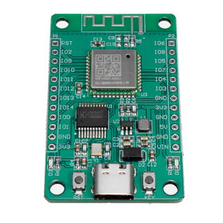
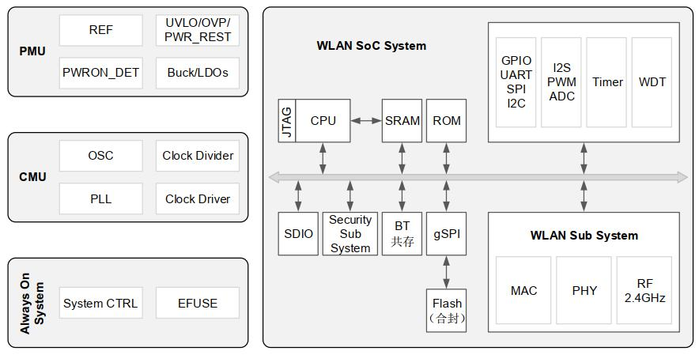
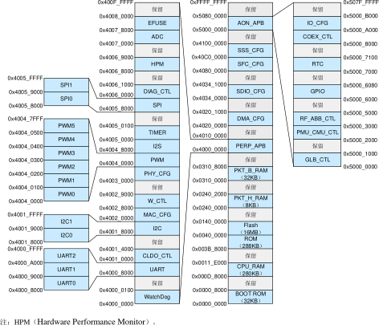
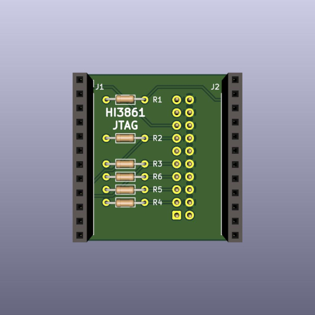
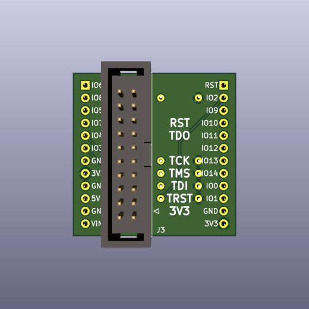
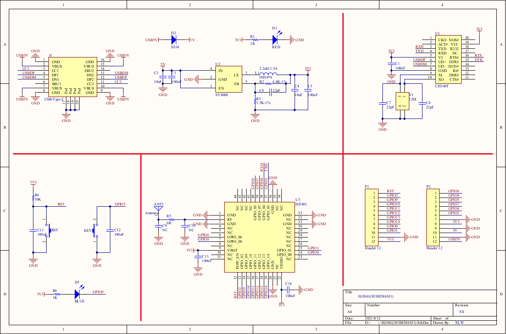

# Hi3861 Notes

[](pictures/hi3861_module.jpg)

[Hi3861](https://www.hisilicon.com/en/products/smart-iot/ShortRangeWirelessIOT/Hi3861V100) is a 32-bit risc-v microcontroller, made by Huawei/HiSilicon.

- 160 MHz
- 352 kbyte ram in total, 280 kbyte ram available for user programs
- 2 mbyte flash
- WiFi
- Bluetooth

## block diagram



This is a block diagram of the Hi3861 processor.
External components are a 40MHz crystal, a 32768 Hz crystal, and a pcb antenna. Flash memory is connected via spi. The HI3861 has 2 Mbyte flash memory.

The HI3861 shares die with the HI3881 wifi video camera. The HI3881 IP camera version does not have flash memory.

## memory map



This is the memory map of the Hi3861. 保留 = reserved.

- RAM (rx): ORIGIN = 0x000D8000, LENGTH = 280K
- ROM  (rx):     ORIGIN = 0x003B8000, LENGTH = 288K
- FLASH (rwx):  ORIGIN = 0x00400000, LENGTH = 16M

16 Mbyte address space is mapped to spi flash, but the HI3861 spi flash is only 2 Mbyte in size.

## JTAG

## pins

pin | jtag ||
---|---|---|
IO00|JTAG_TDO|
IO01|JTAG_TCK|
IO02|JTAG_TRSTN|
IO03|JTAG_TDI|
IO04|JTAG_TMS|
IO06|JTAG_MODE|
IO08|JTAG_ENABLE|Pull high

If pin IO8 is low at power-up, pins IO0...IO4 are normal GPIO pins.
If pin IO8 is high at power-up, pins IO0...IO4 are used for JTAG.

JTAG pins IO03, IO04 are also connected with the CH340 usb-serial converter RX, TX pins.

## hi3861 start up mode

Pin|Default state|Low level|High level
---|---|---|---
IO2/REFCLK_FREQ_STATUS|Pull down|40MHz (Default) |24MHz
IO6/JTAG_MODE|Pull down|Normal function mode (Default) |DFT Test mode
IO8/JTAG_ENABLE|Pull down|Ordinary IO (Default) |JTAG enable

## jtag adapter

|[](pictures/hi3861-jtag-front.jpg)|[](pictures/hi3861-jtag-back.jpg)|
|---|---|
|front|back|

A small circuit is needed to enable the JTAG interface. The adapter board plugs in on the back of the Hi3861 module. This adapter board can be soldered by hand.

- [schematic](hi3861-jtag/hi3861-jtag_sch.pdf)
- [kicad pcb design](hi3861-jtag)

## tools

Tools to flash firmware: hiburn, openocd, jlink.

### hiburn

[Hiburn](tools/) is a Windows tool for downloading firmware via the serial port. There is also an open source [linux version of hiburn](https://github.com/OpenHisiIpCam/hiburn). For hiburn to work, the firmware - LiteOS or OpenHarmony - needs to contain the u-boot feature.

### openocd

The [openocd directory](openocd) contains configuration files for the open source tool [openocd](https://openocd.org/). This is what I use to download firmware to a Hi3861 board. Needs a FT2232 module, and the JTAG adapter above.

To build openocd with risc-v extensions:
```
sudo apt-get build-dep openocd
git clone https://github.com/riscv/riscv-openocd
cd riscv-openocd
./bootstrap
./configure --prefix=/opt/riscv-openocd
make
make install
```
To use openocd as gdb server:

```
/opt/riscv-openocd/bin/openocd -f ./interface/hi-ft2232d-ftdi-jtag.cfg -f ./target/hi3861-jtag.cfg
...
Info : clock speed 500 kHz
Info : JTAG tap: hi3861.cpu tap/device found: 0x0000076d (mfg: 0x3b6 (HiSilicon Technologies), part: 0x0000, ver: 0x0)
Info : [hi3861.cpu] datacount=1 progbufsize=3
Info : Disabling abstract command reads from CSRs.
Info : Examined RISC-V core; found 1 harts
Info :  hart 0: XLEN=32, misa=0x40901104
[hi3861.cpu] Target successfully examined.
Info : starting gdb server for hi3861.cpu on 3333
Info : Listening on port 3333 for gdb connections
load_bin
Info : Listening on port 6666 for tcl connections
Info : Listening on port 4444 for telnet connections
```
In another terminal:
```
/opt/riscv-binutils-gdb/bin/riscv-elf-gdb -q
(gdb) target extended-remote :3333
(gdb) file firmware.elf
(gdb) load
```

### jlink

The [jlink directory](jlink) contains a script for the [Segger JLink](https://www.segger.com/products/debug-probes/j-link/) debugger. This script can be modified to flash firmware to a Hi3861.

```
JLink.exe -device RISC-V -Speed 2000 -IF JTAG -jtagconf -1,-1 jlinkBurner.txt
```

### black magic probe

[Black magic probe](https://github.com/blackmagic-debug/blackmagic) is an open source debugger for arm processors. risc-v on bmp is [work in progress](https://github.com/blackmagic-debug/blackmagic/pull/924), support for GD32VF103 and ESP32-C3. To compile an experimental version of bmp for risc-v:

```
git clone -b ruabmbua https://github.com/UweBonnes/blackmagic
cd blackmagic
patch -p1 < ../blackmagic/hi3681.patch
make PROBE_HOST=hosted
```
Connect to JTAG with FT2232. The Hi3861 is recognized, but more work is needed.

## toolchain

Compile the riscv toolchain from source:

```
git clone --recursive https://github.com/riscv/riscv-gnu-toolchain
cd riscv-gnu-toolchain/
mkdir build
cd build/
../configure --prefix=/opt/riscv32 --with-arch=rv32im --with-abi=ilp32
make
```

## gdb

gdb, the companion debugger for gcc. Build gdb for risc-v from source:

```
git clone https://github.com/riscv/riscv-binutils-gdb.git
cd riscv-binutils-gdb
patch -p1 < risc-v-gdb.patch
cd ..
mkdir build
cd build
../riscv-binutils-gdb/configure --prefix=/opt/riscv-binutils-gdb/ --target=riscv-elf --program-prefix=riscv-elf-
make all
sudo make install
```

If you start a 64-bit gdb, and connect to a 32-bit target, it may be necessary to specify architecture first:

```
(gdb) set architecture riscv:rv32
```
## operating systems

The Hi3861 is supported by two Huawei operating systems: LiteOS and OpenHarmony.

## rust

Rust application example for hi3861. Install rust from [rustup](https://rustup.rs/). Install [riscv xpack](https://xpack.github.io/riscv-none-embed-gcc/).

```
git clone https://gitee.com/luojia65/hihope-hi3861-example
cd hihope-hi3861-example
cargo build
```
Check binary:
 
```
$ /opt/riscv-binutils-gdb/bin/riscv-elf-objdump -f target/riscv32imac-unknown-none-elf/debug/hihope-hi3861-example
target/riscv32imac-unknown-none-elf/debug/hihope-hi3861-example:     file format elf32-littleriscv
architecture: riscv:rv32, flags 0x00000112:
EXEC_P, HAS_SYMS, D_PAGED
start address 0x00400000
```

Flash firmware. With openocd running, type:
```
/opt/riscv-binutils-gdb/bin/riscv-elf-gdb -q
(gdb) target extended-remote :3333
(gdb) file target/riscv32imac-unknown-none-elf/debug/hihope-hi3861-example
(gdb) load 
Loading section .text, size 0x9fa lma 0x400000
Loading section .rodata, size 0x258 lma 0x4009fc
Start address 0x00400000, load size 3154
Transfer rate: 68 KB/sec, 1577 bytes/write.
(gdb) quit 
```

## hardware

[](schematics/Hi3861_303HI386101.pdf)

The picture above is the schematic of [this board](pictures/hi3861_module.jpg).

- [reference design](http://www.hihope.org/en/) and [documentation](http://www.hihope.org/en/download/download.aspx?mtt=26)
- [Tiny-Hi3861](https://github.com/imliubo/Tiny-Hi3861). Original on [gitee](https://gitee.com/meng_guan/Tiny-Hi3861/)
- [genkipi](https://gitee.com/genkipi/devboard_device_itcast_genkipi)

Modules with in-built pcb antenna are probably easiest to use in your own designs.

- [FN-LINK 3161H-I](doc/Fn-Link_3161H-I_datasheet_V4.0_20200601.pdf)
- [AI-Thinker](https://docs.ai-thinker.com/en/hi)

## links

- [Hi3861V100 product page](https://www.hisilicon.com/en/products/smart-iot/ShortRangeWirelessIOT/Hi3861V100)
- [riscv toolchain for LiteOS](https://device.harmonyos.com/en/docs/documentation/guide/quickstart-lite-steps-hi3861-setting-0000001105989316)
- [hiburn for linux](https://github.com/OpenHisiIpCam/hiburn)
- [Hi3861 on aliexpress](https://www.aliexpress.com/item/1005003339044104.html)
- [Installing Liteos on Hi3861 (in Chinese)](https://harmonyos.51cto.com/posts/4013)

If you find errors in this document, please open an issue.
If this page saved you some time, maybe you want to buy me a cup of tea.  Thank you.

[](https://ko-fi.com/Q5Q03LPDQ)
