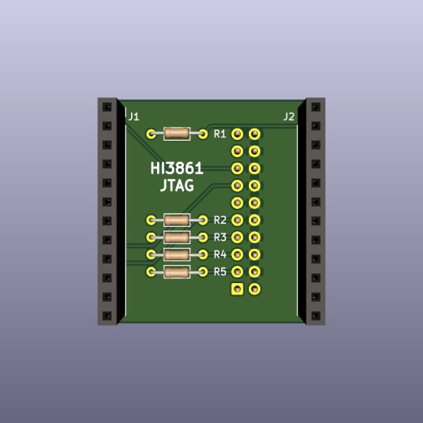
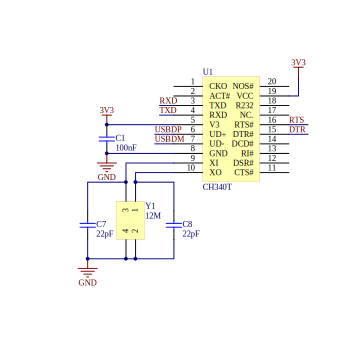

# Hi3861 Notes

[](pictures/hi3861_module.jpg)

[Hi3861](https://www.hisilicon.com/en/products/smart-iot/ShortRangeWirelessIOT/Hi3861V100) is a 32-bit risc-v microcontroller, made by Huawei/HiSilicon.

- 160 MHz
- 288 kbyte rom
- 352 kbyte ram in total, 280 kbyte ram available for user programs
- 2 mbyte flash
- WiFi
- Bluetooth

## block diagram


This is a block diagram of the Hi3861 processor.
External components are a 40MHz crystal, a 32768 Hz crystal, and a pcb antenna. Flash memory is connected via spi. The HI3861 has 2 Mbyte flash memory.

The HI3861 shares die with the HI3881 wifi video camera. The HI3881 IP camera version does not have spi flash memory. The HI3881 runs software from rom.

## memory map


This is the memory map of the Hi3861. 保留 = reserved.

- RAM (rx): ORIGIN = 0x000D8000, LENGTH = 280K
- ROM  (rx):     ORIGIN = 0x003B8000, LENGTH = 288K
- FLASH (rwx):  ORIGIN = 0x00400000, LENGTH = 16M

16 Mbyte address space is mapped to spi flash, but the HI3861 spi flash is only 2 Mbyte in size.

## JTAG

## pins

pin | jtag ||
---|---|---|
IO00|JTAG_TDO|
IO01|JTAG_TCK|
IO02|JTAG_TRSTN|
IO03|JTAG_TDI|
IO04|JTAG_TMS|
IO06|JTAG_MODE|
IO08|JTAG_ENABLE|Pull high

If pin IO8 is low at power-up, pins IO0...IO4 are normal GPIO pins.
If pin IO8 is high at power-up, pins IO0...IO4 are used for JTAG.

If JTAG_ENABLE is high at power-up, pins IO03, IO04 are used for JTAG.  If JTAG_ENABLE is low at power-up, pins IO03, IO04 are used as console serial port RX, TX pins. Conflict is possible if using usb serial and JTAG at the same time.

## hi3861 start up mode

Pin|Default state|Low level|High level
---|---|---|---
IO2/REFCLK_FREQ_STATUS|Pull down|40MHz (Default) |24MHz
IO6/JTAG_MODE|Pull down|Normal function mode (Default) |DFT Test mode
IO8/JTAG_ENABLE|Pull down|Ordinary IO (Default) |JTAG enable

## jtag adapter

|[](pictures/hi3861-jtag-front.jpg)|[](pictures/hi3861-jtag-back.jpg)|
|---|---|
|front|back|

A small circuit is needed to enable the JTAG interface. The adapter board plugs in on the back of the Hi3861 module. This adapter board can be soldered by hand.

- [schematic](hi3861-jtag/hi3861-jtag_sch.pdf)
- [kicad pcb design](hi3861-jtag)

## Boot

The boot process of Hi3861 consists with three parts: romboot, flashboot and kernel (user code, or the OS itself).

1. The fixed **romboot** verifies the **flashboot** at `FLASH_BASE`, copies the flashboot to `0x10A000` (which is actually `CPU_RAM_BASE + 200KB`) and executes. Since the first 64 bytes in the bootable image is the signature header, the actual entry is `0x10A040`
2. The **flashboot** then verifies and boots the **kernel** at `FLASH_BASE + 0xD3C0`.

## Build

A full build of LiteOS generates several images. Finally a `Hi3861_demo_allinone.bin` can be imported to the HiBurn tool to flash. Here is a flow chart of the build progress:


Though not documented, the signature header is simple. There is an open source signing tool in Python: [sign_bin.py](https://github.com/xingrz/hal_hisilicon/blob/319fce6760d25510ffae30f06c8d2190db636db2/hi3861/boot/sign_bin.py)

## tools

Tools to flash firmware: hiburn, openocd, jlink.

### hiburn

The tool to download firmware to the HI3861/HI3881 through the serial port is called **hiburn**. There is a hiburn from Huawei, and there are open source versions. These are different tools that share the same name.

- [Hiburn](tools/) is a Windows tool from Huawei for downloading firmware via the serial port.
- The Zephyr project has an [open source alternative  for Hi3861](https://github.com/xingrz/zephyr/blob/87f33dc624405e1a0e99fb78715cfd644421106b/scripts/west_commands/runners/hiburn.py).
- There is also an open source linux version of [hiburn for Hi3881](https://github.com/OpenHisiIpCam/hiburn).

The protocol to flash Hi3861 is a combination of a private command procotol and [Ymodem](https://en.wikipedia.org/wiki/YMODEM). Though the client side (HiBurn) is not open source, we can see how the protocol looks from the server side: [loaderboot](https://gitee.com/openharmony/device_soc_hisilicon/blob/master/hi3861v100/sdk_liteos/boot/loaderboot/common/cmd_loop.c) from the LiteOS/OpenHarmony SDK. Just like the flashboot, the entry of the loaderboot is at `0x10A040`.

For hiburn to work, LiteOS or OpenHarmony needs to contain the u-boot feature.

### openocd

The [openocd directory](openocd) contains configuration files for the open source tool [openocd](https://openocd.org/). This is what I use to download firmware to a Hi3861 board. Needs a FT2232 module, and the JTAG adapter above.

To build openocd with risc-v extensions:
```
sudo apt-get build-dep openocd
git clone https://github.com/riscv/riscv-openocd
cd riscv-openocd
./bootstrap
./configure --prefix=/opt/riscv-openocd
make
make install
```
To use openocd as gdb server:

```
/opt/riscv-openocd/bin/openocd -f ./interface/hi-ft2232d-ftdi-jtag.cfg -f ./target/hi3861-jtag.cfg
...
Info : clock speed 500 kHz
Info : JTAG tap: hi3861.cpu tap/device found: 0x0000076d (mfg: 0x3b6 (HiSilicon Technologies), part: 0x0000, ver: 0x0)
Info : [hi3861.cpu] datacount=1 progbufsize=3
Info : Disabling abstract command reads from CSRs.
Info : Examined RISC-V core; found 1 harts
Info :  hart 0: XLEN=32, misa=0x40901104
[hi3861.cpu] Target successfully examined.
Info : starting gdb server for hi3861.cpu on 3333
Info : Listening on port 3333 for gdb connections
load_bin
Info : Listening on port 6666 for tcl connections
Info : Listening on port 4444 for telnet connections
```
In another terminal:
```
/opt/riscv-binutils-gdb/bin/riscv-elf-gdb -q
(gdb) target extended-remote :3333
(gdb) file firmware.elf
(gdb) load
```
### ft2232

[](pictures/ft2232hl_big.jpg)

[FT2232HL](https://ftdichip.com/products/ft2232hl/) is an ic that interfaces between between usb and uart, jtag, swd, spi, or i2c. FT2232 is well supported by OpenOCD. The FT2232 board above has the advantage that the board has the same pinout as a Segger JLink, so you can use the same cable for both OpenOCD and JLink. [FT2232HL Board Schematic V3](ft2232hl/FT2232HL%20Board%20sch%20V3.pdf).

### jlink

The [jlink directory](jlink) contains a script for the [Segger JLink](https://www.segger.com/products/debug-probes/j-link/) debugger. This script can be modified to flash firmware to a Hi3861.

```
JLink.exe -device RISC-V -Speed 2000 -IF JTAG -jtagconf -1,-1 jlinkBurner.txt
```
Under linux:
```
 $ rlfe /opt/jlink/JLinkExe -device RV32 -if JTAG -speed 1000 -jtagconf -1,-1 -AutoConnect 1
Connecting to target via JTAG
ConfigTargetSettings() start
ConfigTargetSettings() end
TotalIRLen = ?, IRPrint = 0x..000000000000000000000000
ConfigTargetSettings() start
ConfigTargetSettings() end
TotalIRLen = 5, IRPrint = 0x01
JTAG chain detection found 1 devices:
 #0 Id: 0x0000076D, IRLen: 05, HiSilicon RV32
Debug architecture:
  RISC-V debug: 0.13
  AddrBits: 7
  DataBits: 32
  IdleClks: 5
Memory access:
  Via system bus: No
  Via ProgBuf: Yes (3 ProgBuf entries)
  Via abstract command (AAM): May be tried as last resort
DataBuf: 1 entries
  autoexec[0] implemented: Yes
Detected: RV32 core
CSR access via abs. commands: No
Temp. halted CPU for NumHWBP detection
HW instruction/data BPs: 4
Support set/clr BPs while running: No
HW data BPs trigger before execution of inst
BG memory access support: No
RISC-V identified.
J-Link>
```
jlink has a good implementation of the risc-v debug interface, but support to flash Hi3861 processors is not built in. Keep the JTAG cable short - 6cm or less.

### black magic probe

[Black magic probe](https://github.com/blackmagic-debug/blackmagic) is an open source debugger for arm processors. risc-v on bmp is part of the development sources, but not yet of the release. The Hi3861 is recognized, but support for reading and writing Hi3861 flash is missing.

## toolchain

Compile the riscv toolchain from source:

```
git clone --recursive https://github.com/riscv/riscv-gnu-toolchain
cd riscv-gnu-toolchain/
mkdir build
cd build/
../configure --prefix=/opt/riscv32 --with-arch=rv32im --with-abi=ilp32
make
```

## gdb

gdb, the companion debugger for gcc. Build gdb for risc-v from source:

```
git clone https://github.com/riscv/riscv-binutils-gdb.git
cd riscv-binutils-gdb
patch -p1 < risc-v-gdb.patch
cd ..
mkdir build
cd build
../riscv-binutils-gdb/configure --prefix=/opt/riscv-binutils-gdb/ --target=riscv-elf --program-prefix=riscv-elf-
make all
sudo make install
```

If you start a 64-bit gdb, and connect to a 32-bit target, it may be necessary to specify architecture first:

```
(gdb) set architecture riscv:rv32
```
## operating systems

The Hi3861 is supported by two Huawei operating systems: LiteOS and OpenHarmony. There is also open source for the Zephyr RTOS and the rust language.

The sdk can be compiled with [riscv32-unknown-elf-gcc](https://device.harmonyos.com/en/docs/documentation/guide/quickstart-lite-steps-hi3861-setting-0000001105989316) or with hcc_riscv32, a patched gcc 7.3.  Compared to standard *riscv32-unknown-elf-gcc*, the hcc_riscv32 compiler has extensions for faster interrupts and more compact code:

- "compressed load-byte-unsigned" *lbu* and "store byte" *sb* instructions. Compiler option ``-Wa,-enable-c-lbu-sb``
- "long load immediate" *lli* instruction in 6 bytes, saves 2 bytes. Compiler option ``-femit-lli``
- "store multiple, increment after" *stmia* and "load multiple, increment after" *ldmia* instructions. Pushes/pops register sets on the stack in a single instruction, fast. Used in trap handler.
- merge multiple load and store instructions into "load multiple" *ldm* and "store multiple" *stm* instructions. Compiler option ``-fldm-stm-optimize``

These extensions to standard risc-v are discussed in [Perotti](doc/CARRV2020_paper_12_Perotti.pdf).

## zephyr

[xingrz](https://xingrz.me/) is porting [Zephyr RTOS to Hi3861](https://github.com/xingrz/zephyr/commits/hi3861-dev).

## rust

Rust application example for hi3861. Install rust from [rustup](https://rustup.rs/).
```
git clone https://gitee.com/luojia65/hihope-hi3861-example
cd hihope-hi3861-example
cargo build
```
Check binary:

```
$ /opt/riscv-binutils-gdb/bin/riscv-elf-objdump -f target/riscv32imac-unknown-none-elf/debug/hihope-hi3861-example
target/riscv32imac-unknown-none-elf/debug/hihope-hi3861-example:     file format elf32-littleriscv
architecture: riscv:rv32, flags 0x00000112:
EXEC_P, HAS_SYMS, D_PAGED
start address 0x00400000
```

Flash firmware. With openocd running, type:
```
/opt/riscv-binutils-gdb/bin/riscv-elf-gdb -q
(gdb) target extended-remote :3333
(gdb) file target/riscv32imac-unknown-none-elf/debug/hihope-hi3861-example
(gdb) load
Loading section .text, size 0x9fa lma 0x400000
Loading section .rodata, size 0x258 lma 0x4009fc
Start address 0x00400000, load size 3154
Transfer rate: 68 KB/sec, 1577 bytes/write.
(gdb) quit
```

## hardware

[](schematics/Hi3861_303HI386101.pdf)

The picture above is the schematic of [this board](pictures/hi3861_module.jpg).

## proposal
Compare the schematic above in normal and in JTAG mode.

In normal mode, Hi3861 pin IO4 is serial port input RXD, and connected to CH340T pin 3 TXD, serial port output.

When pin IO8 JTAG_ENABLE is pulled high, pins IO4..IO8 are used in JTAG mode.
In JTAG mode, Hi3861 pin IO4 is  JTAG_TMS output.
This means there is a conflict: two output pins - Hi3861 pin IO4 and CH340T pin 3 - are connected together.

A possible solution is adding a resistor:

|[](pictures/before_patch.svg)|[](pictures/after_patch.svg)|
|---|---|
|before|after|

This way when the usb serial port is idle, CH340T pin 3 is high and R7 acts like a 4.7k pull-up resistor, which is what signal JTAG_TMS requires. Tested with JLINK and FT2232HL.

## other hardware designs

- [reference design](http://www.hihope.org/en/) and [documentation](http://www.hihope.org/en/download/download.aspx?mtt=26)
- [Tiny-Hi3861](https://github.com/imliubo/Tiny-Hi3861). Original on [gitee](https://gitee.com/meng_guan/Tiny-Hi3861/)
- [genkipi](https://gitee.com/genkipi/devboard_device_itcast_genkipi)

Modules with in-built pcb antenna are probably easiest to use in your own designs.

- [FN-LINK 3161H-I](doc/Fn-Link_3161H-I_datasheet_V4.0_20200601.pdf)
- [AI-Thinker](https://docs.ai-thinker.com/en/hi)

## links

- [Hi3861V100 product page](https://www.hisilicon.com/en/products/smart-iot/ShortRangeWirelessIOT/Hi3861V100)
- [Hi3881 hiburn for linux](https://github.com/OpenHisiIpCam/hiburn)
- [open source hiburn for Hi3861](https://github.com/xingrz/zephyr/blob/87f33dc624405e1a0e99fb78715cfd644421106b/scripts/west_commands/runners/hiburn.py)
- [Hi3861 on aliexpress](https://www.aliexpress.com/item/1005003339044104.html)
- [Installing Liteos on Hi3861 (in Chinese)](https://harmonyos.51cto.com/posts/4013)
- [Zephyr RTOS for Hi3861](https://github.com/xingrz/zephyr/commits/hi3861-dev).
- FT2232HL [schematic](https://github.com/arm8686/FT2232HL-Board) and [shop](https://www.aliexpress.com/item/32975940318.html).

[xingrz](https://xingrz.me) provided the sections about booting, building LiteOS, Zephyr and flashing with the hiburn protocol.

This document may contain errors. If you find errors in this document, please open an issue or a pull request.
If this page saved you some time, maybe you want to buy me a cup of tea.  Thank you.

[](https://ko-fi.com/Q5Q03LPDQ)
